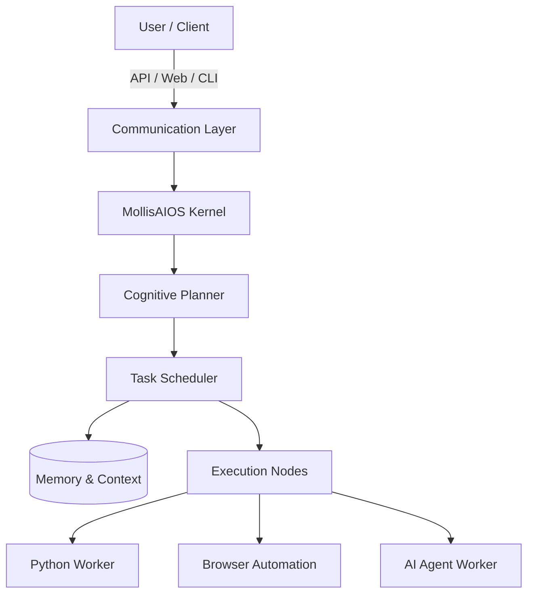

<div align="center">
  <h1>🌌 MollisAIOS</h1>
  <p><strong>The Production-Grade AI Operating System for the Enterprise</strong></p>

  <p>
    <a href="#"></a>
    <a href="#"></a>
    <a href="#"></a>
    <a href="#"></a>
  </p>
</div>

---

## 🚀 Executive Summary

Welcome to **MollisAIOS**. Built by the world’s leading AI engineering team, MollisAIOS is not just another wrapper or chatbot framework—it is a **complete, foundational operating system for Artificial Intelligence**.

Designed to handle mission-critical, enterprise-scale AI operations, MollisAIOS provides the underlying runtime to manage, execute, coordinate, and monitor autonomous AI agents, complex toolchains, and distributed workflows. We are building the infrastructure that will power the next generation of intelligent enterprise software.

---

## 🆚 MollisAIOS vs. Open CLW: The Evolution of AI Workloads

Many users migrating from **Open CLW** and similar legacy frameworks ask: *Why MollisAIOS?*

While Open CLW provides a functional baseline for standard AI interactions and prototyping, it fundamentally lacks the architectural rigor required for mission-critical production environments. 

**Here is why MollisAIOS is the superior choice:**

| Feature | Open CLW | 🌌 MollisAIOS |
| :--- | :--- | :--- |
| **Architecture** | Script-based, tightly coupled | **Modular, SOLID, Clean Architecture** |
| **Scalability** | Single-threaded or basic async | **Distributed, Horizontally Scalable** |
| **Memory Management**| Basic short-term context | **Advanced Vectorized Long-term Memory** |
| **Fault Tolerance** | Minimal error recovery | **Deterministic retries, fail-safes, & timeouts**|
| **Target Audience** | Hobbyists & Researchers | **Enterprise Engineering Teams** |

**What makes MollisAIOS better?**
Instead of relying on fragile prompt chains, MollisAIOS treats AI workflows as deterministic operating system processes. Our Scheduler and Task Queue manage resources efficiently, our Executor model isolates potential failures, and our Multi-Agent orchestration enables true parallel cognitive processing. 

---

## 🏗️ Enterprise-Grade Architecture

MollisAIOS is built strictly on modern software engineering principles. We don't cut corners.

*   **Clean Architecture & SOLID Principles**: Absolute separation of concerns.
*   **Agnostic Execution**: Plug-and-play support for any LLM provider (OpenAI, Anthropic, open-source).
*   **Deterministic State Machines**: Predictable, monitorable, and auditable agent behavior.
*   **High-Concurrency Scheduler**: Military-grade task management and execution routing.

### System Topology



---

## 🌟 Core Capabilities (The Roadmap to V1)

We are systematically rolling out the definitive AI Operating System. 

### Phase 1: The Core Kernel (✅ Complete)
A robust engine capable of generating, managing, and tracking stateful tasks. Built using Python 3.12+, utilizing advanced typing, validation, and strict object-oriented design.

### Phase 2: The Scheduler (🚧 In Progress)
A high-throughput scheduler managing task queues, priorities, retry mechanisms, and background execution loops.

### Phase 3: The Execution Layer
Specialized execution environments to interact with the real world:
*   🐍 **Python Executor**: Sandboxed code execution.
*   🌐 **Browser Executor**: Headless web automation.
*   ⚙️ **API/Shell Executor**: Direct system integration.

### Phase 4: Persistent Memory
A unified vector and metadata storage system to provide autonomous agents with context, long-term recall, and semantic knowledge retrieval.

### Phase 5 & 6: Autonomous Multi-Agent Workflows
A cognitive planner that decomposes user requests into actionable graphs, assigning them to specialized autonomous agents (Coding Agents, Review Agents, Deployment Agents) that collaborate perfectly.

---

## 💻 Developer Experience

We believe in a pristine developer experience. 

```python
# Example: Initializing the MollisAIOS Kernel
from app.runtime.managers import TaskManager
from app.runtime.models import Task, Priority

kernel = TaskManager()

# The system manages execution deterministically
task = Task(
    name="Generate Financial Report",
    priority=Priority.HIGH,
    retries=3
)
kernel.submit(task)
```

### Directory Structure

```text
mollisaios/
├── app/
│   ├── runtime/          # The Core Engine
│   │   ├── models/       # Data Contracts & Schemas
│   │   ├── managers/     # State & Lifecycle Managers
│   │   ├── exceptions/   # Strict Error Handling
│   │   └── utils/
│   └── main.py
├── tests/                # Comprehensive Test Suites
├── pyproject.toml        # Modern Dependency Management
└── README.md
```

---

## 🛡️ Production Philosophy

**"We don't build toys. We build infrastructure."**

Every line of code in MollisAIOS is written with production in mind. We prioritize:
1.  **Test-Driven Development**: If it isn't tested, it doesn't ship.
2.  **Strict Typing**: We leverage Python 3.12+ type hints to their absolute limit.
3.  **Extensibility**: Every component is an interface. Swap our components with yours seamlessly.

---

## 🤝 Enterprise Support & Open Source

MollisAIOS is open source, but designed for the enterprise. 
If your company is looking to scale its AI operations beyond simple API wrappers and unstable scripts, MollisAIOS provides the bedrock for your next-generation intelligent applications.

<div align="center">
  <i>Engineered for the future of AI.</i><br>
  <b>© 2026 Mollis AI</b>
</div>
